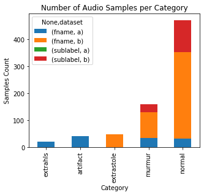
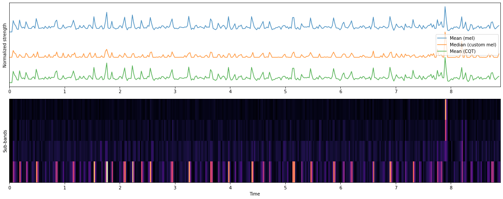

# Heartbeat Classification

Heartbeat classification with CNN and LSTM neural networks to compare their performance.


## Install dependencies

To install all the necesary dependencies, run in the terminal:

``` pip install - r requirements ```

## Data exploration

You can check Data_exploration Jupyter Notebook to explore the data I will be using in this project. In this chart we can see the
 distribution of the classes in the dataset.



<br>

Also, you can find different plots where you can check for example the onset strength (check <a href='https://librosa.github.io/librosa/'>librosa</a> python library).
Onset strength computes a spectral flux onset strength envelope. Onset strength at time t is determined by: mean_f max(0, S[f, t] - ref_S[f, t - lag]) where ref_S is S after local max filtering along the frequency axis [1]. By default, if a time series y is provided, S will be the log-power Mel spectrogram.




## Performance comparison

 I have trained an CNN and a LSTM neural network. You can go to LSMT_model jupyter notebook to see all the process.